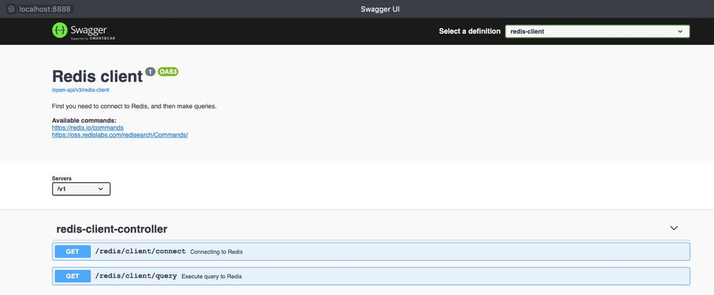

# Redis client

This is a Redis web client with Swagger UI, it will help you make any queries to Redis if you don't have access to the redis-cli.

### How to run

1. Download the runnable jar file [redis-client-1.0.0.jar](raw/redis-client-1.0.0.jar)
2. Run the redis-client-1.0.0.jar (need an installed JDK 8+)
    - You can run it by double clicking it if your registry for jar file is configured correctly.
    - Or you can run it from command line, and input `java -jar redis-client-1.0.0.jar`.
3. Open the link in the browser - http://localhost:8888/open-api-ui
